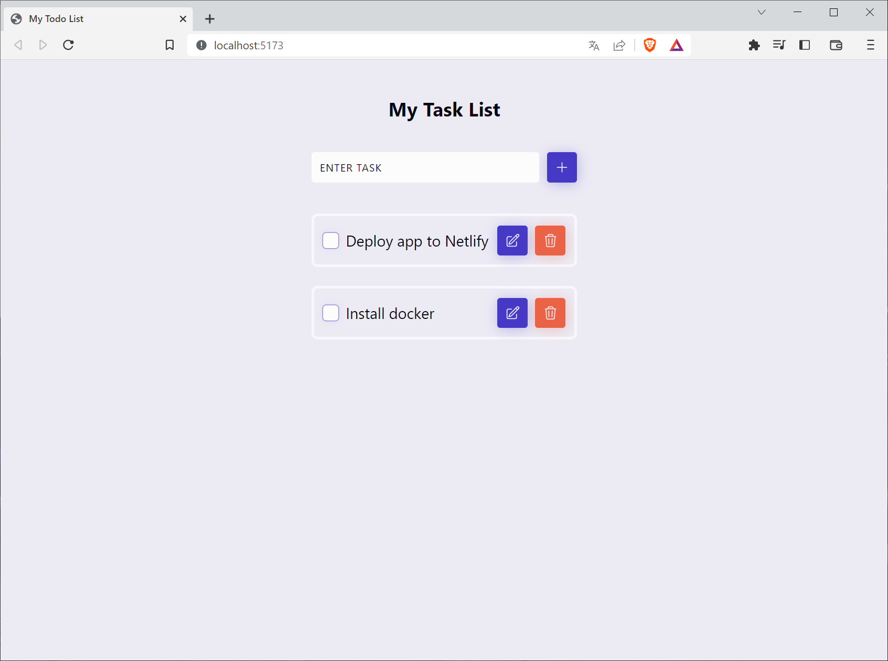

# React Todo App with Local Storage

This is a simple to-do list app that has the basic features of persisting to local storage.

To get a project up and running:
1. Unzip the project you downloaded.
2. Open the unzipped directory in you code editor.
3. Run `pnpm install` to install all the dependencies.
4. Run `pnpm run dev` to start the app.
